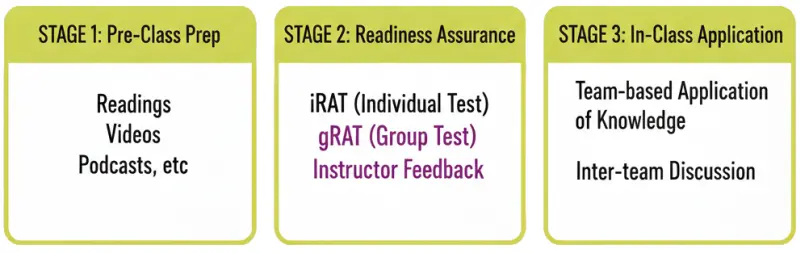
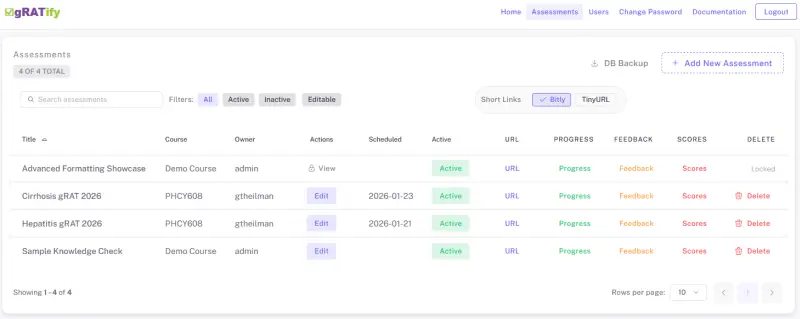
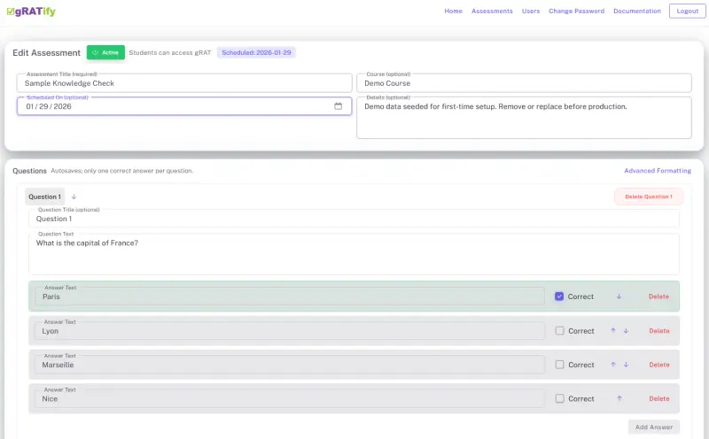
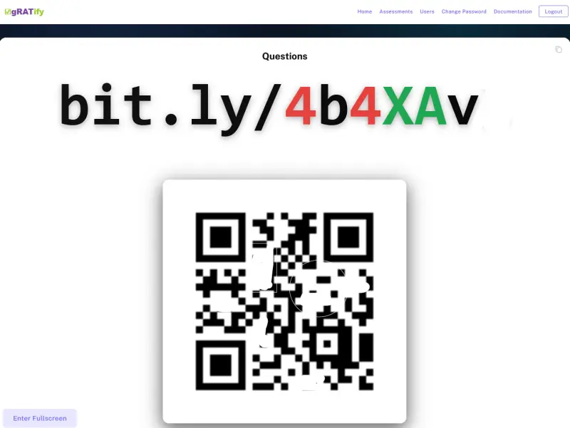
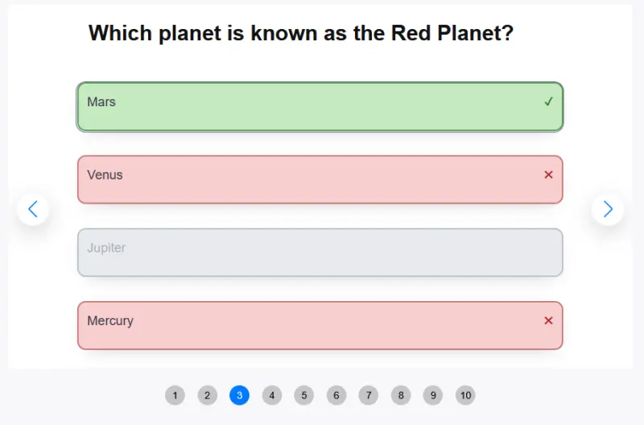
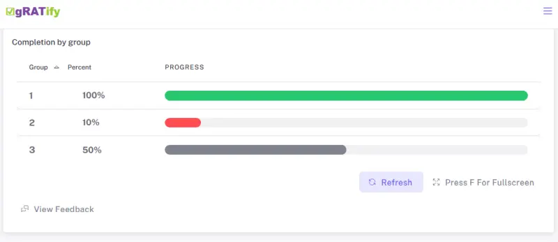
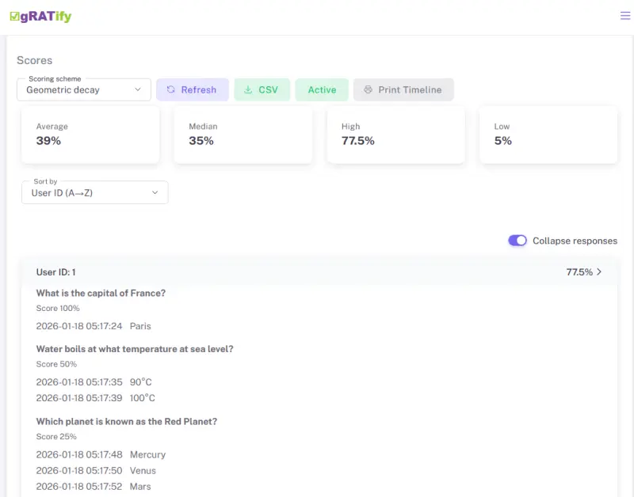
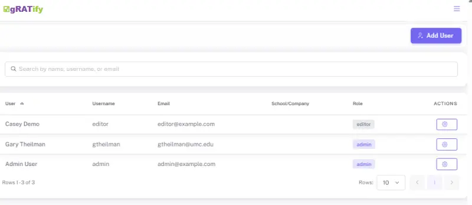

# Group Readiness Assurance Testing

**gRATify is a web application for administering group Readiness Assurance Tests (gRATs) in Team-Based Learning (TBL).**  

* Immediate feedback to student teams
* Allows repeated answer attempts until the correct choice is found
* Visually tracks team progress in real time
* Supports the instructor feedback phase by summarizing how teams answered each question on their first attempt. 



---

## How gRATify Works 

- Students work in **teams** and come to a consensus as to which answer to choose
- Teams submit **one answer at a time**
- Immediate feedback (correct/incorrect) is provided after each selection
- Incorrect answers do **not** lock the team out
- The process continues until the correct answer is selected
- **Team progress is tracked visually using progress bars**, allowing instructors to see how teams are moving through the gRAT in real time (and *encourage* dawdlers)
- The application **facilitates the instructor feedback phase** of Team-Based Learning by:
  - Displaying each question
  - Showing the **percentage of teams that selected each answer as their *first guess***
  - This helps the instructor decide if there is a need to spend class time further explaining the concept

Excellent explanations of the full TBL process are widely available in books and online resources.

---


## Screenshots & [Online Demo](https://gRATify-app.com): 

Need to use this format for images once repo is public.









---

[Online Demo](https://gRATify-app.com):     Let's you login and look around.  Resets every night. 


## Requirements
#### This software is still in development.  Please keep that in mind.

- **Docker is required**
- A reverse proxy (e.g., Nginx, Apache) to serve the application
- A database:
  - **SQLite**: evaluation/testing only
  - **MySQL, MSSQL or PostgreSQL**: required for real classroom use

> ⚠️ **Important:** SQLite does **not** handle concurrent submissions well and is not suitable when multiple teams are submitting answers at the same time.

---

## Source Code and Docker Images

- The **source code is included** in this repository for:
  - Transparency
  - Security review
  - Forking and experimentation
- **However, Docker images are the intended deployment method**
  - I recommend using the Docker image, not the source code.
  - I'm trying to avoid the "It works on my machine" situations
  - The Docker image packages Laravel with compatible PHP and dependencies.  Don't need to worry about having PHP or node on your host.
  - If you are determined to run this from the source code, follow the usual steps for Laravel 12 apps ( `composer install`, `npm install`, `npm run build`, etc. )
  - The application listens on **port 8080** inside the container.  Use your own web server to reverse proxy to an available port.

---

## Installation Overview

Setup consists of:

1. Creating an application directory
2. Generating and editing a `.env` file
3. Creating a database
4. Running migrations and seeds
5. Starting the Docker container


---

## Pull the Docker Image

```bash
docker pull ghcr.io/gtheilman/gratify:latest
```

---

## Generate the `.env` File

Create a directory for your application and change into it:

```bash
mkdir gratify
cd gratify
```

Generate a starter `.env` file:

```bash
docker run --rm \
  --entrypoint /usr/local/bin/generate-env \
  ghcr.io/gtheilman/gratify:latest > .env 2>/dev/null
```
This will:
- Create a `.env` file
- Generate and populate a valid `APP_KEY`


The `.env` file is hidden. Use `ls -a` to see it.


### Editing the `.env` File

Edit the file using your preferred editor:

```bash
nano .env
```

You **must** set at least:

- `APP_URL`
- `SANCTUM_STATEFUL_DOMAINS`
- Database connection values
- `APP_KEY`, but that should be populated automaticaly when `.env` is generated

#### Line Endings (Important)

- Use **LF**, not CRLF
- If editing on Windows and copying to Linux:
  ```bash
  sed -i 's/\r$//' .env
  sed -i '1s/^\xEF\xBB\xBF//' .env
  ```

---

## Database Setup

### SQLite (Evaluation Only)

The default configuration uses SQLite so you can get started quickly.  

Copy this command while in the same directory as your `.env` file:

```bash
docker run --rm \
  -v "$(pwd)":/work \
  -v "$(pwd)/.env":/var/www/html/.env \
  --env-file "$(pwd)/.env" \
  --entrypoint sh \
  ghcr.io/gtheilman/gratify:latest -lc '
set -e
DB_DIR=/work/database
DB_FILE=/work/database/database.sqlite
mkdir -p "$DB_DIR"
if getent passwd www-data >/dev/null 2>&1; then chown -R www-data:www-data "$DB_DIR" || true; fi
chmod 2775 "$DB_DIR" || true
php -r "\$db=\"${DB_FILE}\"; \$pdo=new PDO(\"sqlite:\".\$db); \$pdo->setAttribute(PDO::ATTR_ERRMODE, PDO::ERRMODE_EXCEPTION); \$pdo->exec(\"PRAGMA foreign_keys=ON;\"); echo \"SQLite created/verified: \$db\\n\";"
chmod 664 "$DB_FILE" || true
chmod 664 "${DB_FILE}-wal" "${DB_FILE}-shm" 2>/dev/null || true
if command -v sqlite3 >/dev/null 2>&1; then sqlite3 "$DB_FILE" "PRAGMA journal_mode=WAL; PRAGMA foreign_keys=ON; VACUUM;" >/dev/null; fi
cd /var/www/html
php artisan optimize:clear
php artisan migrate --force
php artisan db:seed --force
ls -lh "$DB_FILE"
'
```

If you use this method, **migrations and seeding are already complete**.

While you are in the same directory as the .env file, start the application with 

```bash
docker run -d \
  --name gratify \
  -p 8080:8080 \
  -v "$(pwd)":/work \
  -v "$(pwd)/.env":/var/www/html/.env \
  --env-file "$(pwd)/.env" \
  ghcr.io/gtheilman/gratify:latest
```

---

### MySQL /  MSSQL  / PostgreSQL (Recommended)

For classroom use, a MySQL, MSSQL or PostgreSQL database is needed.  

You need to create an empty database (e.g., `gratify`) and a database user authorized to use that database.  

Make sure that you have the proper database and user settings entered in your `.env` file.

```bash
DB_CONNECTION=mysql
DB_HOST=127.0.0.1
DB_PORT=3306
DB_DATABASE=grat
DB_USERNAME=grat_user
DB_PASSWORD=grat_password
```

Then, use these commands in the same directory as your `.env` file:

*(Required) Creates tables and admin account*

```bash
docker run --rm \
  -v "$(pwd)/.env":/var/www/html/.env \
  --env-file "$(pwd)/.env" \
  ghcr.io/gtheilman/gratify:latest \
  php artisan migrate --force
```

*(Optional) Create sample gRATs and users:*

```bash
docker run --rm \
  -v "$(pwd)/.env":/var/www/html/.env \
  --env-file "$(pwd)/.env" \
  ghcr.io/gtheilman/gratify:latest \
  php artisan db:seed --force
```

---

The application always serves on port 8080.   If you need to have it available on a different port, change the first "8080" in the command below.

While you are in the same directory as the .env file, start the application with 


```bash
docker run -d \
  --name gratify \
  -p 8080:8080 \
  -v "$(pwd)/.env":/var/www/html/.env \
  --env-file "$(pwd)/.env" \
  ghcr.io/gtheilman/gratify:latest
```

> The URL you use to access the application **must match** `APP_URL` in your `.env` file.

> Reverse proxy configuration is **beyond the scope** of this README.  Ask someone with a **stuffed penguin sitting on their desk** for help.

> Strongly recommend against trying to run this as a subfolder (https://example.com/gratify).   It just doesn't work well with Laravel.  I've tried.

## Docker Compose
This doesn't setup the `.env` file or the database.  You still have to use the Docker commands above.   

There's no real advantage to using Docker Compose unless you are trying to also run other containers (e.g., database, Redis, Caddy, etc.).  from the same Compose file.
```yaml
services:
  gratify:
    image: ghcr.io/gtheilman/gratify:latest
    container_name: gratify
    restart: unless-stopped

    # App serves HTTP on 8080 *inside* the container.
    # Use your own reverse proxy for real-world deployments.
    ports:
      # Change the left side to whatever external port you want (80 shown here).
      - "8080:8080"

    # Demo working directory (e.g., SQLite lives under /work/database)
    # # ./:/work is not needed if using MySQL, MSSQL or PostgreSQL.  Doesn't hurt to leave it.
    volumes:
      - ./:/work
      - ./.env:/var/www/html/.env

    # Load environment variables from local .env
    env_file:
      - .env


# Notes:
# - SQLite is for evaluation only (concurrency limitations).
# - For real classroom use, configure MySQL, MSSQL or PostgreSQL via DB_* values in .env.
# - Migrations/seeds are run manually per the README:
#     docker compose run --rm gratify php artisan migrate --force
#     docker compose run --rm gratify php artisan db:seed --force

```

I find it helpful add *gratify_cache* section to automatically clear routes, views and caches.  


```yaml


x-gratify-image: &gratify-image ghcr.io/gtheilman/gratify:latest

services:
  gratify_cache:
    image: *gratify-image
    container_name: gratify_cache
    restart: "no"
    volumes:
      # ./:/work is not needed if using MySQL, MSSQL or PostgreSQL.  Doesn't hurt to leave it.
      - ./:/work
      - ./.env:/var/www/html/.env
    env_file:
      - ./.env
    working_dir: /var/www/html
    command:
      - sh
      - -lc
      - |
        set -e
        php artisan config:clear
        php artisan route:clear
        php artisan view:clear
        php artisan event:clear

  gratify:
    image: *gratify-image
    container_name: gratify
    restart: unless-stopped
    ports:
      - "8080:8080"
    volumes:
      # ./:/work is not needed if using MySQL, MSSQL or PostgreSQL.  Doesn't hurt to leave it.
      - ./:/work
      - ./.env:/var/www/html/.env
    env_file:
      - ./.env
    working_dir: /var/www/html
    depends_on:
      gratify_cache:
        condition: service_started
 

```


## First Login

```
Email:    admin@example.com
Password: admin
```

- You will be **forced to change the password** on first login
- After changing it, log in again with the new password
- I'd suggest creating an "Editor" account for day-to-day use

---

## Managing the Container

```bash
docker start gratify
docker stop gratify
```
If you make changes that don't seem to be showing up when you reload, run these
```bash
docker exec -it gratify php artisan cache:clear
docker exec -it gratify php artisan optimize
```
---

## Email Configuration (Optional)
Really only need this for password reset emails.   
If you can remember your own password, you can leave this disabled.

```env
MAIL_ENABLED=false
```
If you want to send "Forgot Password" emails, set up the mailer in your `.env` file.

```bash
MAIL_ENABLED=true
MAIL_MAILER=smtp
MAIL_HOST=your_smtp_host.com
MAIL_PORT=587 
MAIL_USERNAME=your_smtp_username
MAIL_PASSWORD=your_smtp_password
MAIL_ENCRYPTION=tls 
MAIL_FROM_ADDRESS="hello@example.com"
MAIL_FROM_NAME="${APP_NAME}"
```

## Redis (Optional)
Laravel supports Redis.   I'm honestly not sure how much of a performance boost you get by using it. 
But, you can edit the `.env` file to add it, if you like.  

```bash
REDIS_CLIENT=predis
# Important!  The app supports predis, not phpredis
REDIS_PREFIX=gratify_app_
REDIS_HOST=redis_host
REDIS_PASSWORD=null
REDIS_PORT=6379
# Optional: Use separate DBs for cache and general use
REDIS_DB=0
REDIS_CACHE_DB=1 
```
Then, update the other variables
```bash
CACHE_DRIVER=redis
SESSION_DRIVER=redis
QUEUE_CONNECTION=redis
```

Keep in mind that gRATify is running inside a Docker container.  The easiest way to make sure both gRATify and Redis can find each other is to run them together in a Docker Compose file.
```bash
services:
  redis:
    image: redis:latest
    container_name: redis
    restart: unless-stopped
    command: ["redis-server", "--appendonly", "yes"]
    volumes:
      - redis_data:/data
    networks:
      - gratify_net
    healthcheck:
      test: ["CMD", "redis-cli", "ping"]
      interval: 5s
      timeout: 3s
      retries: 20

  gratify:
    image: ghcr.io/gtheilman/gratify:latest
    container_name: gratify
    restart: unless-stopped
    ports:
      - "8080:8080"
    volumes:
      # ./:/work is not needed if using MySQL, MSSQL or PostgreSQL.
      - ./:/work
      - ./.env:/var/www/html/.env
    env_file:
      - ./.env
    networks:
      - gratify_net
    depends_on:
      redis:
        condition: service_healthy

networks:
  gratify_net:
    driver: bridge

volumes:
  redis_data:
```

---

## URL Shortening (Optional)
If you want student URLs shortened, get a tinyurl or Bitly account token and put it in the `.env` file.

```env
BITLY_ACCESS_TOKEN=
TINY_URL_TOKEN=
```
The shortened URL is only created once.  You can't change it once it's been created. That's to prevent "spending" credits creating links over-and-over.

---
## "App" Delivery Platforms
The setup instructions are going to be a bit different if you are using a service that serves Docker containers without setting up a full server.  

I'm talking about services like *AWS App Runner* and *Digital Ocean App Platform*, etc.    I've installed *gRATify* successfully on *Google Cloud Run*.
-  Still set up the `.env` file because you are going to need an APP_KEY.  
-  The values in the `.env` file are going to need to be copied into the platform interface.  Refer to the documentation for the platform.
-  Keep in mind that these platforms do not have persistent storage.   Using SQLite is a bad idea because **it's going to be erased when you stop the container**.   You need to have MySQL, MSSQL or PostgreSQL set up somewhere else. 
-  You'll still need to set up your MySQL, MSSQL or PostgreSQL database according to the instructions here.    You *may* be able to do that from within the app platform.  See the platform's documentation about running console commands.
-  If your platform requires the container to listen on its provided `$PORT` (Heroku-style), set `DYNAMIC_PORT=1` in `.env`. Otherwise, leave it unset and have the platform use the default 8080.


---

## In-Class Process
- Display the website on the big screen in the front of the auditorium
- Click "URL" to display the link the students need to use to open the questions.
- Tell the class that only one student in each group should open the questions.
- The page will ask for an identifier.   I tell students just to enter their team number (e.g, 6).  **Do not use student names**.  You should not consider this software in any way "FERPA Compliant".   It just has whatever security Laravel 12 has by default.

- When everyone has opened the questions, display the "Progress" screen.
- After groups have identified all correct answers, they have an opportunity to submit "Appeals" if they think their answer is better than the key.
- After all groups have finished, display "Feedback".  Review the answers with the students and, if necessary, discuss the learning objective.
- Set the gRAT as "inactive". This prevents students from accessing it after class.
- When you are back in your office, look at "Scores".  Review submitted appeals and select scoring algorithm.

- I've been asked if the same gRAT can be used for multiple classes.    You can't erase student responses from the first class that answers the gRAT questions.  If you want each class to start with a "blank" gRAT, you'll need to create multiple gRATs.   The easiest way to do this is to export an Aiken file with the questions, then create new gRATs and import the file to populate the questions and answers.
---

## Entering Math and Formatted Text in Questions and Answers
- The application supports simple Markdown formatting of questions and answers.
- It also supports Katex and AsciiMath for displaying equations.


---

## Aiken Import/Export
- You can import and export gRATs using Aiken format.  This is a plain text format for questions.
- I usually write my questions as Aiken text files and import them into a blank gRAT.  I just use the on-screen editor for small changes.
- The easiest way to duplicate a gRAT is to export it in Aiken format, create a new gRAT and import that same file.
---
## Locking, deletion prevention, active/inactive
- Once students start answering gRATs, you can't change the gRAT or delete it. 
- You can make the gRAT "active" or "inactive".   Students can't access an "inactive" gRAT even if they know the URL.   
---
## Scoring
I use "geometric decline" scoring.   
- Picking the correct answer on the first try give full credit
- Needing two guesses gives 50% credit
- Needing three guesses gives 25% credit
- Needing four guesses givess 12.5% credit.

You can also choose "linear decline". The drop per wrong attempt is based on the **number of answer choices**:
- With 10 answers: 100 → 90 → 80 → 70 → ... 10  (minus 10 each miss)
- With 5 answers: 100 → 80 → 60 → 40 → 20  (minus 20 each miss)

I've also added "linear decline with zeros". This was in response to some people who were a bit indignant that students would get any credit at all if they had to click on every single choice before finding the correct answer:
- With 5 answers: 100 → 80 → 60 → 40 → 0 (minus 20 each miss but zero if all possible choices were clicked).
- With 10 answers: 100 → 90 → 80 → 70 → ... 0 (minus 10 each miss but zero if all possible choices were clicked).


The program does not display scores to students.  So, you are free to change the scoring method to whatever you like before you enter them into your LMS (Canvas, Blackboard)

---

## Users
You can create as many accounts for different users as you like.  
  - "Editors" can only see the the gRATs they've created
  - "Admin" can see everyone's gRATs
  - "Editors" cannot see the "Users" screen
  - "Editors" cannot download the database backup.
---

## Database Backup
I've included a button to download a gzipped copy of your database.   

There isn't a "Restore Database" function in the software.  If you have to use your backup, you'll need to interact with your database directly.

---
 

## Student Appeals
In the Team-based Learning process, students are given an opportunity to "appeal" that the answer they chose is better than the one indicated by the key.   
The faculty will review their appeal outside of class.
When students have completed answering all questions, buttons will appear on the page which allow them to submit appeals.  They can only submit once and can't edit their rationale.
This can be turned on and off by the faculty by a setting found at the top of the "Feedback" page.   For convenience, the toggle disappears if it is changed, but it can be brought back by reloading the page.
The idea is that appeals are allowed by default.  The faculty can turn off submissions just before going over the feedback with the class.
Once the faculty gets to their office and reviews "Scores", they can see the appeals that were left by the students.

---

## Asynchronous Buffer
I've had too many situations where there have been transient Wi-Fi outages in the classroom (even just a few seconds) that cause students a lot of anxiety.

I decided to set up an asynchronous buffer where students can continue to answer questions even if the Internet briefly goes down.  The application will transmit what the students have done to the server automatically when the Wi-Fi comes back. 

This background processing of answers should be unnoticable to the students.   But, if the program has not completely finished saving all their answers at the end of the gRAT, a red box will pop up warning the students not to close their browser.   It will count down until all the answers are safely on the server.  Then, another message will pop up saying it's okay to close the browser tab.

The asynchronous buffer requires that the browser support IndexedDB.   If it doesn't (very old browsers or some with "incognito" modes), the application will fall back to requiring each choice the student makes be confirmed as saved on the server before the student is allowed to try to answer again.  That's usually just a few seconds. 

In all cases, it requires no special change in behavior on the part of the student.

---

## Support and Expectations

- This project is **not guaranteed** to fit every institutional setup. It's not a commercial product. This is "Faculty helping faculty"
- I make my living as a pharmacist, not a programmer.   
- I’ll help where I can.

---

## License

Licensed under the **Apache License 2.0**.  
See the `LICENSE` file for details.

## AI Disclosure

I've written various versions of this software "by hand".  The last major revision was in 2021 and used Laravel 7.

I used A.I. to update this to the current Laraval 12 version.
